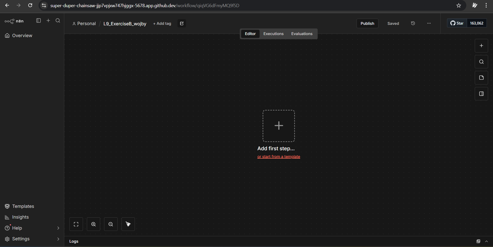
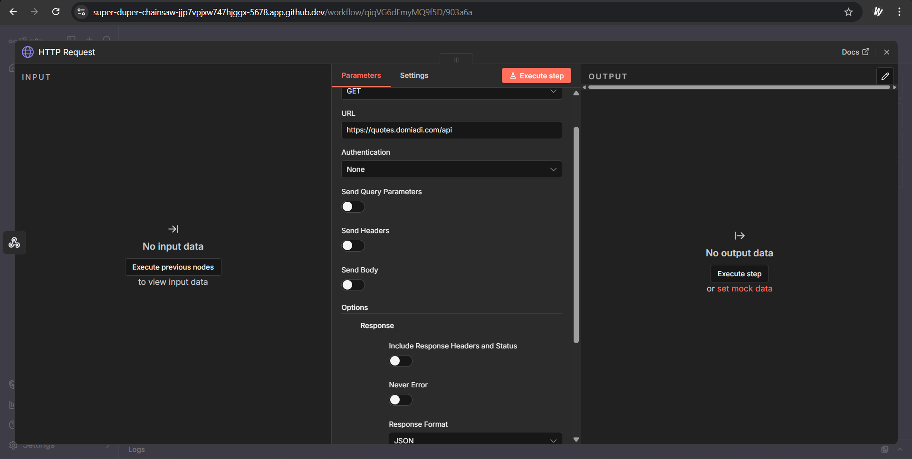
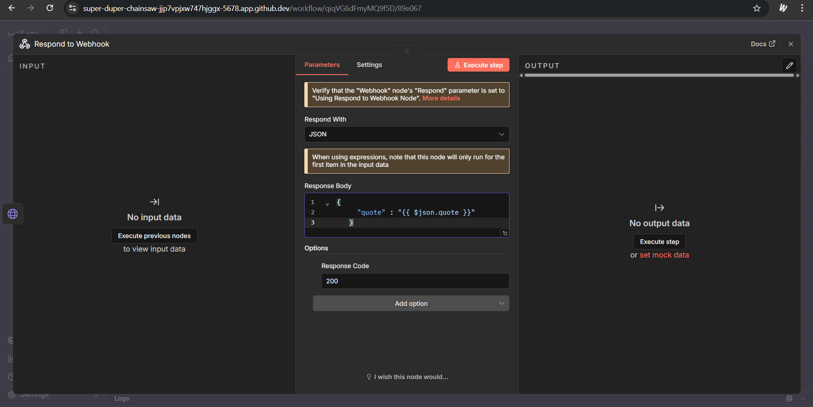
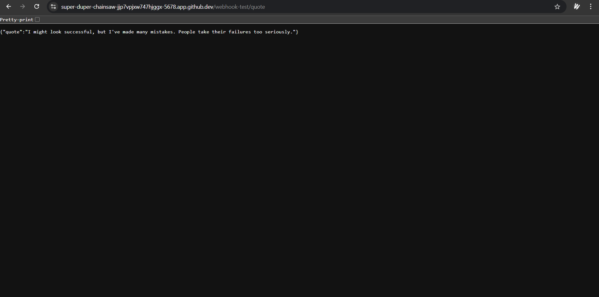

During Exercise B I have created a workflow that receives a request and then returns a random message from external API in JSON. Unfortunately API does not work, so there is an error message instead of expected one.