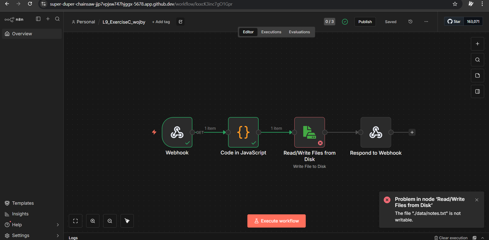

During Exercise C I have created a workflow that receives a note, adds a timestamp and then appends text to a file stored in a codespace. Unfortunately there is a problem because file in data is not writable.